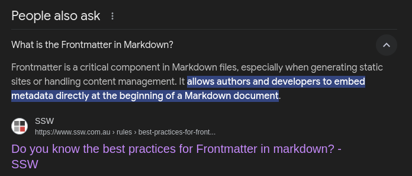
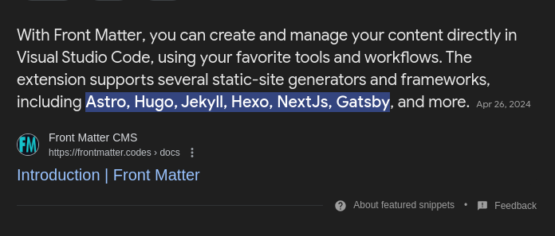

# FrontMatter-Plugin Documentation

## Overview

The `FrontMatter` class provides a convenient way to parse markdown content with front matter using the `markdown-it` library. This class extracts metadata defined in the front matter section and renders the markdown body, making it easy to work with structured markdown content.

## Installation

To use the `FrontMatter` class, include the following scripts in your HTML file:

```html
<script src="https://cdn.jsdelivr.net/npm/markdown-it@10.0.0/dist/markdown-it.min.js"></script>
<script src="http://cdn.jsdelivr.net/gh/ksdeshappriya/FrontMatter-Plugin/frontMatter-cdn.js"></script>
```

## Usage

### Example

```html
<!DOCTYPE html>
<html>
<head>
  <meta charset="UTF-8">
  <title>Markdown Parser</title>
  <script src="https://cdn.jsdelivr.net/npm/markdown-it@10.0.0/dist/markdown-it.min.js"></script>
  <script src="https://cdn.jsdelivr.net/gh/ksdeshappriya/FrontMatter-Plugin/frontMatter-cdn.js"></script>
</head>
<body>
  <script>
    document.addEventListener("DOMContentLoaded", function() {
      const parser = new FrontMatter();
      const src = `---
title: Hello World
author: Jane Doe
tags: [markdown, parser]
---

# This is a heading

This is some text.
`;

      const output = parser.getOutputAsJson(src);
      console.log(output);
    });
  </script>
</body>
</html>
```

## Usage Functions

### FrontMatter-Plugin

#### Constructor

```javascript
new FrontMatter()
```

Creates a new instance of the `FrontMatter` class.

#### getOutputAsJson

```javascript
getOutputAsJson(markdownContent)
```

Gets the rendered output as a JSON string.

- **Parameters:**
  - `markdownContent` (string): The markdown content as a string.
- **Returns:**
  - (string): JSON string containing the `frontMatter` and `markdownBody`.

## Credit

- **markdown-it**: A powerful markdown parser that enables flexible rendering of markdown content. For more information, visit [markdown-it on GitHub](https://github.com/markdown-it/markdown-it).
- **markdown-it-front-matter**: A plugin for `markdown-it` that processes front matter containers in markdown files. For details, check out the [markdown-it-front-matter repository](https://github.com/ParkSB/markdown-it-front-matter).


-----

## What is FrontMatter:




## Why you want to use this?

If you’re looking for a CDN link for FrontMatter Markdown (often used in static site generators and documentation systems), it typically allows you to easily include FrontMatter parsing functionality in your project without needing to host the library yourself. This can streamline the setup process and ensure that you’re using a reliable version.
